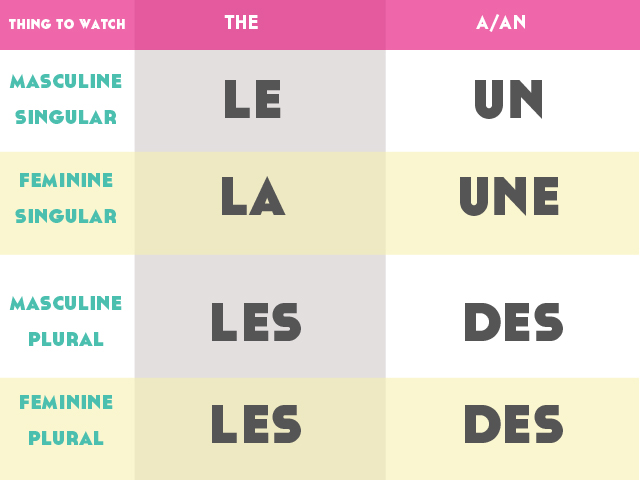

## French Animals - Les Animaux

## French Animals

- all animals in english can be said in french. However when saying these animals there are ***articles*** that we must keep in mind

## Articles in  French
- ***Articles*** -This indicates the gender of the noun *(masculine or feminine)* and its number *(singular or plural)*

> :bulb: The Word articles was added to our [Glossary](../pages/glossary.md)

## French Animal

> :bulb: Below you can find some Animals and their french translation. Alll these can be found in the Glossary under Animals section.

- ***(le) chien*** - Dog
- ***(le) chat*** - Cat
- ***(la) souris*** - Mouse
- ***(le) singe*** - Monkey
- ***(le) poisson rouge*** - Gold Fish
- ***(le) poisson*** - Fish
- ***(le) chevre*** - Goat
- ***(le) lapin*** - Rabbit
- ***(le) cochon d'inde*** - Guinea Pig
- ***(le) canard*** - Duck
- ***(le) cheval*** - Horse
- ***(le) perroquet*** - Parrot
- ***(le) hamster*** - Hamster
- ***(le) lézard*** - Lixard
- ***(le) serpent*** - Snake
- ***l'oiseau*** - Bird
- ***(le) tortue*** - Turtle
- ***(le) grenouille*** - Frog
- ***(la) vache*** - Cow
- ***(le) cochon*** - Pig
- ***(le) tarentule*** - Spider
