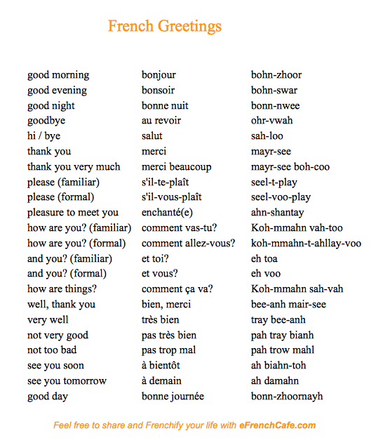

## French Greetings And Goodbyes - Les Salutations

### What are Greetings?

- ***Greetings*** - Greetings is a formal or informal expression of welcome or recognition.

> :bulb: The word ***Greetings*** was added to our [Glossary](../pages/glossary.md)

## How do i greet someone in French?

French greetings are one of the best places to start when you learn French. After all, you do need greetings before you start a dialogue.

The most important thing to remember though is the formality. Some greetings are considered very informal meaning you can use them with your friends but on the Formal Side of things you have to be careful how you greet persons you just meet. However, some greetings are neuetral meaning they work in both formal and informal situations

## French Greetings and their Pronunciation

> :bulb: Below you can find some common greetings, Goodbyes among others

