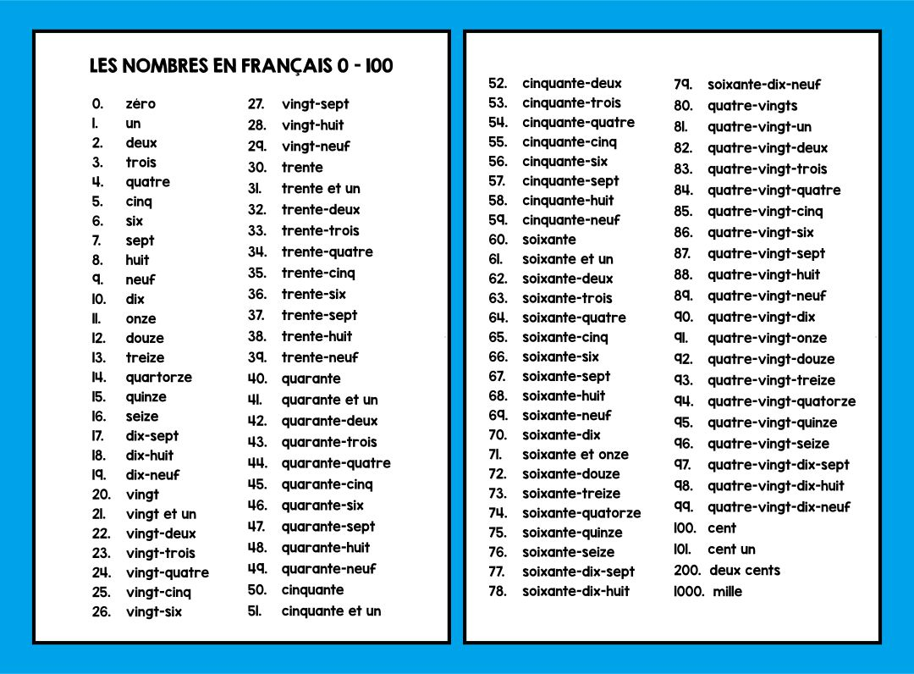

## French Numbers - Les Nombres

### What are Numbers?

- ***Numbers*** - A number is a mathematical object used to count, measure, and label.

> :bulb: The word ***Numbers*** was added to our [Glossary](../pages/glossary.md)

## How Do We use Numbers in French?

Numbers are used the same way in French that we Do in English.

This could be to  count, label, list items, do math, among other numerical tasks

## French Numbers

> :bulb: Below you can find a list of French Numbers ranging from 0 - 100

